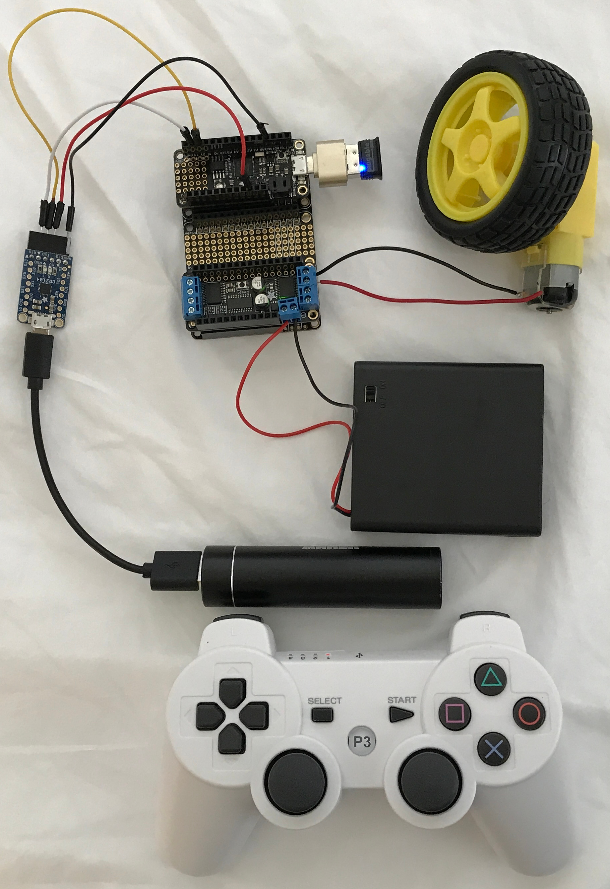

# Control DC Motor with a PS3 Bluetooth wireless controller

Demonstrate using a PS3 Bluetooth wireless controller to control motor speed.
This projects uses the USB host capability of the SAMD21. The [USB Host Library
for SAMD](https://github.com/gdsports/USB_Host_Library_SAMD) is required to
make this work.

## Dependencies

* [USB Host Library for SAMD](https://github.com/gdsports/USB_Host_Library_SAMD)
* Adafruit Motor Shield V2 Library by Adafruit

## Components

* 1 x Adafruit Feather M0 Express
* 1 x Adafruit FeatherWing Motor Controller
* 1 x Clone PS3 Bluetooth wireless controller
* 1 x USB Bluetooth plug
* 1 x USB OTG to host cable or adapter
* 1 x USB micro cable
* 1 x 5V, 1A power bank for Feather and USB Bluetooth plug
* 1 x 4AA battery pack for motors
* 1 x CP2104 USB serial
* 1 x FeatherWing Tripler board

